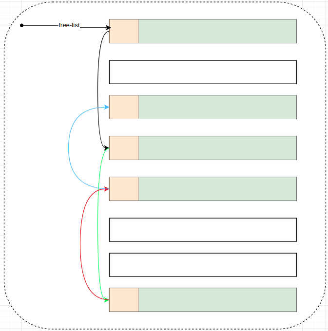

# allocator

STL（Standard Template Library，标准模板库）中的`allocator`是一个模板类，它负责在C++程序中动态地分配和释放内存。`allocator`是STL容器如`vector`、`list`、`map`等背后用于内存管理的核心组件，尽管对于大多数日常编程任务，开发者通常不需要直接与其交互。`allocator`的设计遵循了“策略模式”，允许不同的内存分配策略，但标准库默认提供的`std::allocator`是最常用的实现。

### 实现原理

1. **类型无关性**：`allocator<T>`是一个模板类，其中`T`是要分配的类型的占位符。这意味着你可以为任何数据类型创建一个特定的allocator实例。

2. **内存分配与释放**：`allocator`通过调用C++的全局`operator new`和`operator delete`来分配和释放内存。这使得它能够跨平台工作且与系统内存管理机制兼容。但是，理论上，`allocator`的实现可以被定制，以使用其他内存管理技术，比如内存池。

3. **对齐要求**：确保分配的内存块满足特定类型的对齐要求，这对于某些硬件或特定类型的数据（如SIMD向量）是必要的。

4. **不抛出异常**：标准规定，`allocator`的内存分配函数在失败时不会抛出异常，而是通过返回一个无效的指针（通常是`nullptr`）来指示失败。

### 使用实例

尽管直接使用`allocator`的情况较少，了解其基本用法有助于深入理解STL容器的工作方式。下面是一个简单的使用示例，展示如何直接使用`allocator`来分配和释放内存。

```cpp
#include <iostream>
#include <memory>
#include <vector>

int main() {
    // 定义一个allocator实例，用于int类型
    std::allocator<int> alloc;

    // 使用allocator分配一块足够存储5个int的内存
    int* ptr = alloc.allocate(5);

    // 检查分配是否成功
    if (ptr == nullptr) {
        std::cerr << "Memory allocation failed.\n";
        return 1;
    }

    // 假设我们在这里对ptr指向的内存进行初始化和使用...

    // 使用完毕后，手动释放内存
    alloc.deallocate(ptr, 5);

    return 0;
}
```

在这个例子中，我们直接使用了`std::allocator<int>`来分配和释放内存。但实际上，STL容器内部已经封装了这些操作，使得用户通常不需要直接与`allocator`打交道。容器会在需要时自动调用相应的分配和释放函数。

### 自定义Allocator

虽然标准`allocator`适用于多数情况，但某些特定场景下，可能需要自定义allocator来实现特定的内存管理策略，比如使用内存池减少内存碎片、优化性能，或者在嵌入式系统中管理有限的内存资源。自定义allocator需要重载`allocate()`和`deallocate()`等关键成员函数，并可能需要处理对齐问题和其他高级特性。

以STL 的运用角度而言，空间配置器是最不需要介绍的东西，它总是隐藏在一切组件(更具体地说是指容器，container)的背后，默默工作，默默付出。但若以 STL 的实现角度而言，第一个需要介绍的就是空间配置器，因为整个 STL 的操作对象(所有的数值)都存放在容器之内，而容器一定需要配置空间以置放资料不先掌握空间配置器的原理，难免在阅读其它STL 组件的实现时处处遇到挡路石


### 内存空闲链表


在看STL内存管理时看到一个很不起眼的数据结构，因为以前没有见到过类似的用法，本着STL中没有废物的原则，因此很好奇，结果一查不得了，原来这个使用方法那么精妙。

```cpp
union _Obj {
    union _Obj* _M_free_list_link;
    char _M_client_data[1];    /* The client sees this.        */
};
```

代码中是一个公用体，首个是指向自己本身类型 `union _Obj* _M_free_list_link;` 的指针，第二个 `char _M_client_data[1];` 经常写C/C++也肯定知道，也相当于一个指针，用来引用数据，那么为什么放两个指针在一个公用体里面？

通过下图我们可以看到实际使用的妙用：



