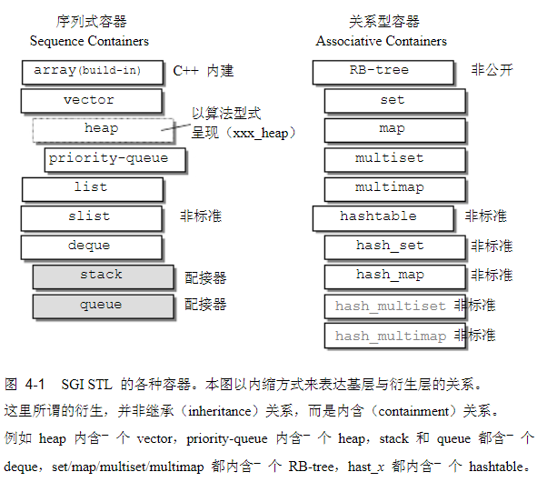
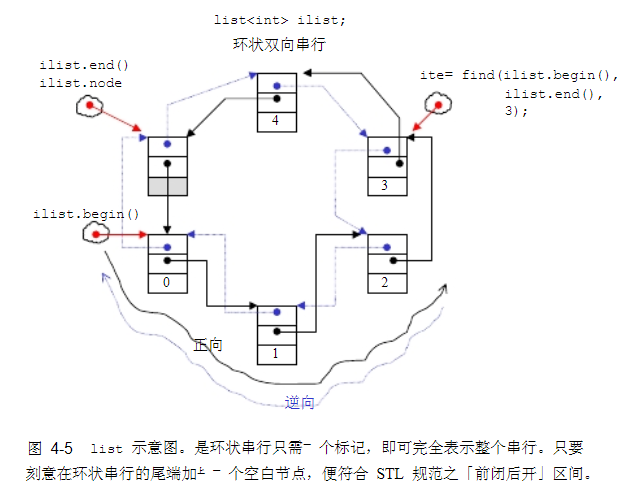
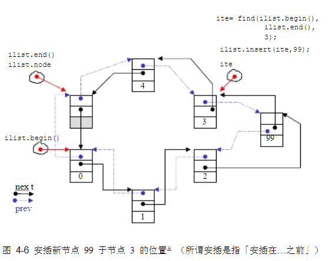
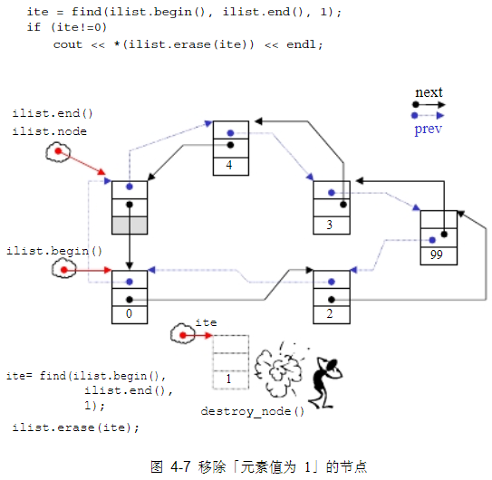

## 序列化容器




### vector
 
 对于vector的任何操作，一旦引起内存的重新分配，都会导致原有迭代器的失效，这里容易犯错，需要注意。
 
 ##### erase
 

 
 ```cpp
iterator erase(iterator __position) {
    if (__position + 1 != end())
      copy(__position + 1, _M_finish, __position);  // 后序元素向前移动
    --_M_finish;
    destroy(_M_finish);  // 删除最后一个
    return __position;
} 
```

#### insert 

备用空间大于插入的元素个数的情况。


插入点之后有两个元素需要后移动


备用空间小于新增元素个数


### list

不像vector每次都是申请一块内存，list每次就配置或释放一个元素空间，因此list对于空间的使用绝对精确，一点也不浪费。而且对于任何位置元素的插入或者删除list都是常数时间。

而且list有一个很好的特性，那就是插入和删除操作都不会导致原有的迭代器失效，list的删除操作也只是导致被指向那个元素的迭代器失效，指向其它元素的迭代器不受影响。

SGI STL中的链表不仅是双向链表，还是一个环状链表，只需要一个指针便可以遍历整个链表。

#### list双向链表

如图将node节点指向一个空的节点，用于表示结尾，这样就能实现一个前闭后开的环状链表



#### list insert

insert会在指定位置插入数据，将该处原先的值向后移动。




#### list erase 

成员擦除操作也只是进行一些指针的移动而已，并不复杂



### deque 

vector是单向开口，deque是双向开口的连续线性空间，所谓双向开口就是两端都能插入和删除。
deque和vector的最大差异，在于deque允许常数时间内对起头端进行元素的插入或移除操作，并且deque没有所谓容量观念，其内存一直是分段的连续空间组合而成，随时可以增加一段的新的空间并链接起来，像vector那样因旧空间不足而重新分配一块更大的空间，然后复制元素再释放旧空间这样的事情deque是不会发生的，也因此deque没有必要提供所谓的空间保留功能。

