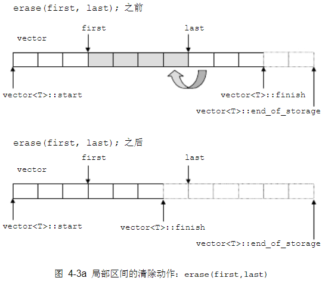
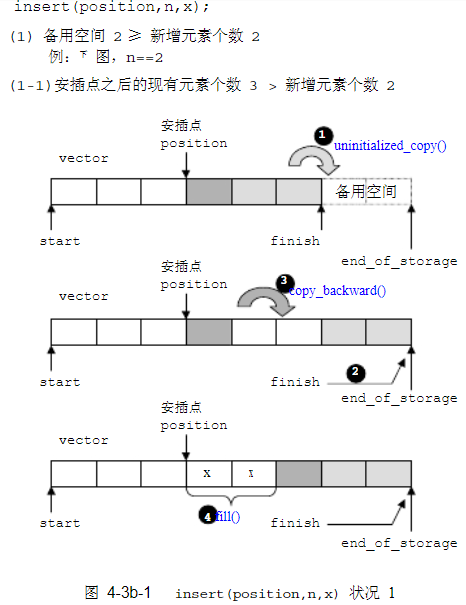
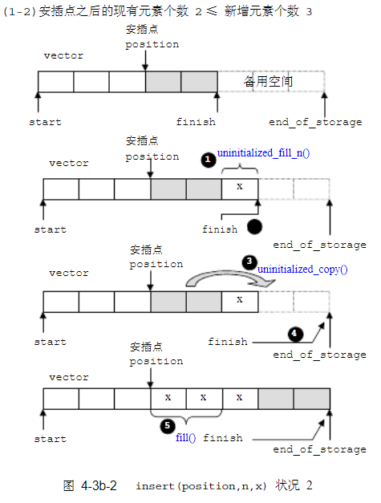
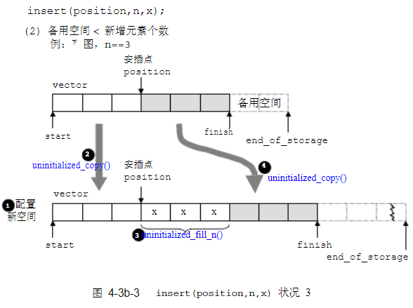

## 序列化容器


### vector
 
 对于vector的任何操作，一旦引起内存的重新分配，都会导致原有迭代器的失效，这里容易犯错，需要注意。
 
 ##### erase
 

 
 ```cpp
iterator erase(iterator __position) {
    if (__position + 1 != end())
      copy(__position + 1, _M_finish, __position);  // 后序元素向前移动
    --_M_finish;
    destroy(_M_finish);  // 删除最后一个
    return __position;
} 
```

#### insert 

备用空间大于插入的元素个数的情况。




插入点之后有两个元素需要后移动




备用空间小于新增元素个数




### list

不像vector每次都是申请一块内存，list每次就配置或释放一个元素空间，因此list对于空间的使用绝对精确，一点也不浪费。而且对于任何位置元素的插入或者删除list都是常数时间。

而且list有一个很好的特性，那就是插入和删除操作都不会导致原有的迭代器失效，list的删除操作也只是导致被指向那个元素的迭代器失效，指向其它元素的迭代器不受影响。


