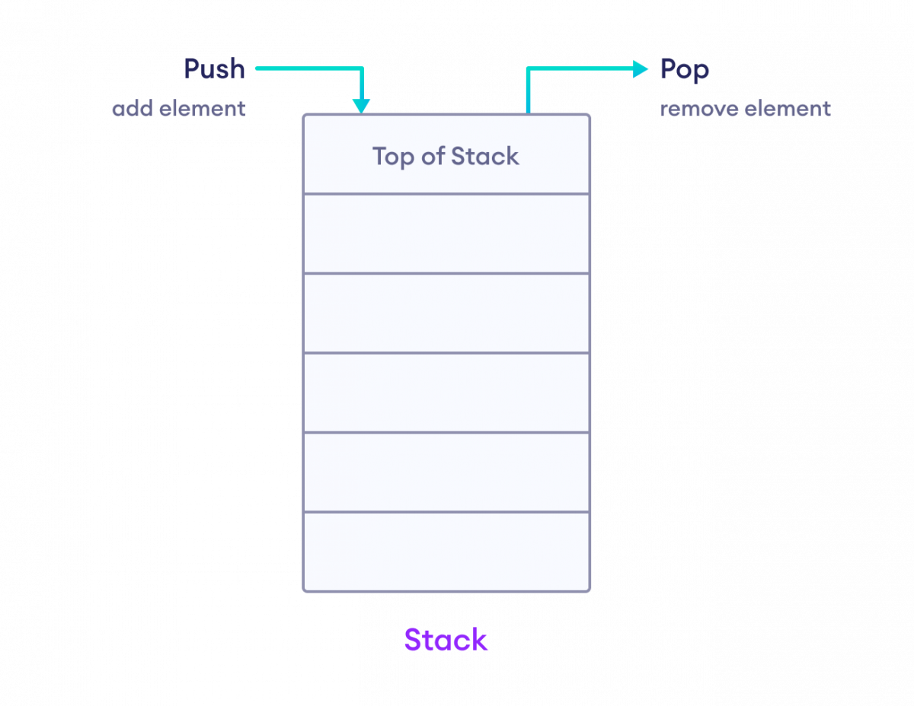

## 序列化容器


### vector
 
 对于vector的任何操作，一旦引起内存的重新分配，都会导致原有迭代器的失效，这里容易犯错，需要注意。
 
 ##### erase
 

 
 ```cpp
iterator erase(iterator __position) {
    if (__position + 1 != end())
      copy(__position + 1, _M_finish, __position);  // 后序元素向前移动
    --_M_finish;
    destroy(_M_finish);  // 删除最后一个
    return __position;
} 
```

#### insert 

备用空间大于插入的元素个数的情况。


插入点之后有两个元素需要后移动


备用空间小于新增元素个数


### list

不像vector每次都是申请一块内存，list每次就配置或释放一个元素空间，因此list对于空间的使用绝对精确，一点也不浪费。而且对于任何位置元素的插入或者删除list都是常数时间。

而且list有一个很好的特性，那就是插入和删除操作都不会导致原有的迭代器失效，list的删除操作也只是导致被指向那个元素的迭代器失效，指向其它元素的迭代器不受影响。

SGI STL中的链表不仅是双向链表，还是一个环状链表，只需要一个指针便可以遍历整个链表。

#### list双向链表

如图将node节点指向一个空的节点，用于表示结尾，这样就能实现一个前闭后开的环状链表


#### list insert

insert会在指定位置插入数据，将该处原先的值向后移动。


#### list erase 

成员擦除操作也只是进行一些指针的移动而已，并不复杂


### deque 

vector是单向开口，deque是双向开口的连续线性空间，所谓双向开口就是两端都能插入和删除。
deque和vector的最大差异，在于deque允许常数时间内对起头端进行元素的插入或移除操作，并且deque没有所谓容量观念，其内存一直是分段的连续空间组合而成，随时可以增加一段的新的空间并链接起来，像vector那样因旧空间不足而重新分配一块更大的空间，然后复制元素再释放旧空间这样的事情deque是不会发生的，也因此deque没有必要提供所谓的空间保留(reserve)功能。


#### deque中的map 

为了实现内存块看起来连续，deque实现了很多复杂的操作，并定义了一个map用来链接这些连续的小块内存

```cpp
protected:
  // 指向指针的指针，deque这里使用其进行数据块的链接
  _Tp** _M_map;
  size_t _M_map_size;  
  iterator _M_start;
  iterator _M_finish;
```

可以看到所谓的map只不过是指向类型数据的指针的指针


在deque中定义了这几个对象，用于维护deque的状态

```cpp
_Tp* _M_cur; // 缓存区中现行的cur元素
_Tp* _M_first; // 缓冲区头
_Tp* _M_last; //缓冲区尾部
_Map_pointer _M_node;  // 指向管控中心
```

以上代码中是在迭代器中进行存储的，再经过一层封装,deque中添加如下成员，便可以轻松实现begin, end等接口

```cpp
_Map_pointer _M_map;   // 指向map段
size_t _M_map_size;
iterator _M_start;  // 整个deque的开头
iterator _M_finish; // 整个map的结尾
```


其对应示意图如下所示


从上图可以看出，每个迭代器的大小是可以指定的，假设定义了如下deque

```cpp
deque<int, alloc, 8>
```

经过一段时间操作之后，deque拥有了20个元素，因为buffsize为8，因此其对应的数据结构如下：


上述deque插入20个元素之后，再插入三个，其代码实现如下：

```cpp
void push_back(const value_type& __t) {
    // 最后缓冲区中有两个以上的备用空间
    if (_M_finish._M_cur != _M_finish._M_last - 1) {
        // 直接在备用空间上构造元素
        construct(_M_finish._M_cur, __t);
        // 调整缓冲区的使用状态
      ++_M_finish._M_cur;
    }
    else   // 只剩下一个备用空间
      _M_push_back_aux(__t);
}
```


现在再向deque插入一个元素，push_back就会调用push_back_aux，先配置一整块缓冲区，在设妥新元素内容

```cpp

// Called only if _M_finish._M_cur == _M_finish._M_last - 1.
template <class _Tp, class _Alloc>
void deque<_Tp,_Alloc>::_M_push_back_aux()
{
  _M_reserve_map_at_back();    // 检查是否需要重新更换map
  *(_M_finish._M_node + 1) = _M_allocate_node(); // 新申请一个缓冲区节点
  __STL_TRY {
    construct(_M_finish._M_cur);  // 构造当前节点
    _M_finish._M_set_node(_M_finish._M_node + 1); // 改变finish让其指向新节点，因为尾节点不再是原来的节点了
    _M_finish._M_cur = _M_finish._M_first;  // cur指向新增缓冲区的开头
  }
    // 失败 就进行回滚
  __STL_UNWIND(_M_deallocate_node(*(_M_finish._M_node + 1)));
}

```


接下来看看在deque前面插入数据的过程


```cpp
void push_front(const value_type& __t) {
    //  第一缓冲区是否有剩余空间
    if (_M_start._M_cur != _M_start._M_first) {
      // 
      construct(_M_start._M_cur - 1, __t);
      --_M_start._M_cur;  // 
    }
    else
       // 第一缓冲区没有剩余空间了
      _M_push_front_aux(__t);
}
```

首次插入第一空间没有剩余空间

```cpp
// 只有cur==first的时候才会调用
// Called only if _M_start._M_cur == _M_start._M_first.
template <class _Tp, class _Alloc>
void deque<_Tp,_Alloc>::_M_push_front_aux()
{
  _M_reserve_map_at_front();   // 检查是否需要重新配置map信息
  *(_M_start._M_node - 1) = _M_allocate_node();  // 为start的前一个map节点申请缓存信息
  __STL_TRY {
    _M_start._M_set_node(_M_start._M_node - 1); // start 指向新申请的节点
    _M_start._M_cur = _M_start._M_last - 1;   // Cur指向新申请节点的尾部倒数第一个元素，因为这个是前向迭代器
    construct(_M_start._M_cur); // 
  }
  __STL_UNWIND((++_M_start, _M_deallocate_node(*(_M_start._M_node - 1))));
} 
```


再次想deque插入元素，由于这次三次申请的空间已经足够用了，只需要将cur向前移动两步就行了


### stack

stack是一种先进后出(First In Last Out, FILO)的数据结构。对stack元素的操作只能对最顶端元素进行，换言之，stack不允许进行遍历操作。  



以某种既有的容器为底部结构，将其对外接口改变，使之符合先进后出的特性，很容易就能实现一个stack。 deque是一个双向开口的容器，若以deque为底部数据结构，并将其顶部操作接口封闭，便很容易实现一个stack，因此在SGI STL中stack的缺省底部结构就是deque。

又因为stack使用底部容器完成所有工作，其具有使用某物接口，形成另一种风格的性质，因此stack也被称之为adapter配接器。很多书中甚至直接将stack归为container adapter而不是将其归为容器。

当然如果你感觉使用deque作为stack容器的底层不合适，STL中的stack是支持自定义的，只要新提供的容器符合stack调用的接口

```cpp
template<typename _Tp, typename _Sequence = deque<_Tp> >
    class stack
{


};

stack<int, list<int>> istack;
```

### queue

queue是一种先进先出(First In First Out, FIFO)的数据结构。Queue只能在底端新增元素，在顶端移出元素，因此Queue也不允许进行遍历。
   


同样deque也有queue的特性，因此SGI STL同样将deque作为queue的底层数据结构。

又因为和stack一样queue使用底部容器完成所有工作，其具有使用某物接口，形成另一种风格的性质，因此queue也被称之为adapter配接器。queue也被许多人归为container adapter而不是将其归为容器。

list同样也是，双向开口的容器，也可以将list指定为queue的底层容器。