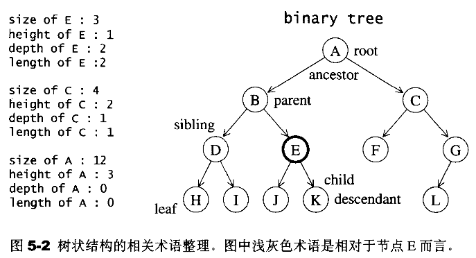
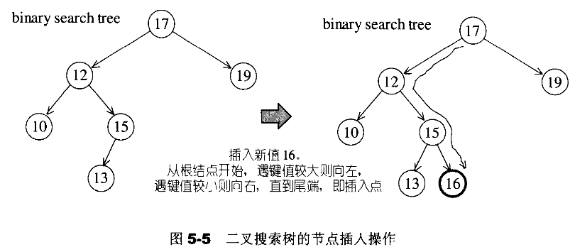
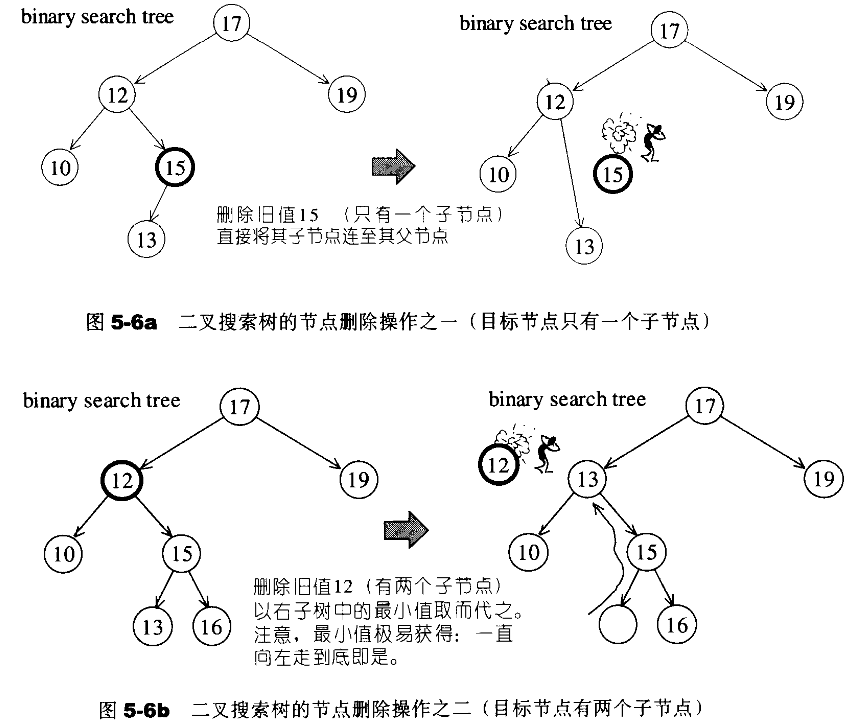
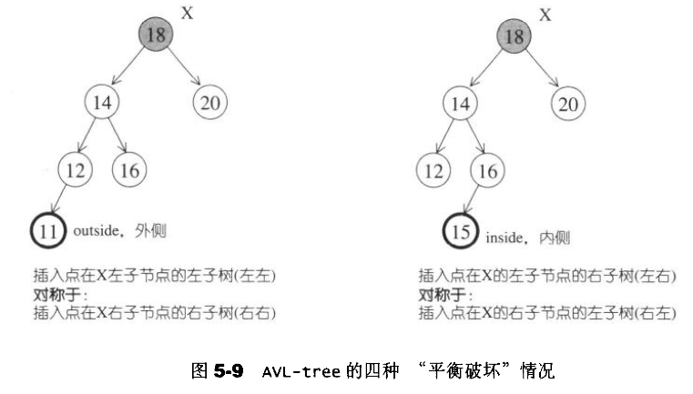
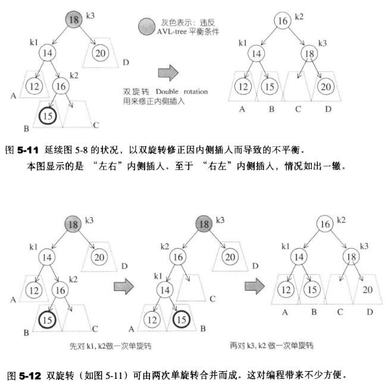
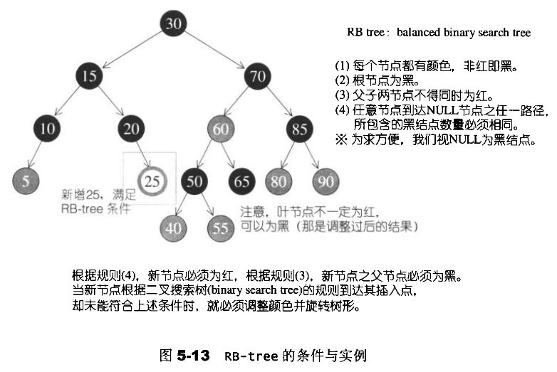
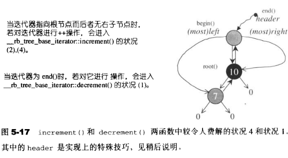

 
## 关联式容器


### 二叉树





### 二叉树插入



### 二叉树删除




### AVL tree

不平衡的状态



单旋转(single Rotation)


双旋转




### RB-tree



红黑树中两种令人费解的迭代情况，出现的原因

```cpp

  void _M_increment()
  {
    if (_M_node->_M_right != 0) {   // 如果有右子节点，就向右走
      _M_node = _M_node->_M_right;
      while (_M_node->_M_left != 0)  // 然后一直走到左子树到底
        _M_node = _M_node->_M_left; //右子树最左边的值就是当前大于节点最小的值，树底部最后一个值就是
    }
    else {
      //   如果当前节点没有右子树
      _Base_ptr __y = _M_node->_M_parent;
      while (_M_node == __y->_M_right) {  // 如果现行节点是父节点的右节点
        _M_node = __y;  // 直接向上追溯 ，直到不为右节点为止
        __y = __y->_M_parent;
      }

      // 如果根节点刚好没有右子节点
      if (_M_node->_M_right != __y)  // 此时的右节点不为父节点，那么父节点就是答案
        _M_node = __y;


    }
  }

  // 只有operator--里面调用
  void _M_decrement()
  {
    //  如果是红节点，并且父节点的父节点等于自己，只有node为header的时候才会发生
    if (_M_node->_M_color == _S_rb_tree_red &&
        _M_node->_M_parent->_M_parent == _M_node)
      _M_node = _M_node->_M_right;
    // 如果有左子节点
    else if (_M_node->_M_left != 0) {
      _Base_ptr __y = _M_node->_M_left;
      // 其左子节点最大值就是答案
      while (__y->_M_right != 0)
        __y = __y->_M_right;
      _M_node = __y;
    }
    else {
      //  非根节点，并且没有左子节点
      _Base_ptr __y = _M_node->_M_parent;
      while (_M_node == __y->_M_left) {
        _M_node = __y;
        __y = __y->_M_parent;
      }
      _M_node = __y;
    }
  }
```
其具体定义如下，特殊实现让header可以纵贯全局，但是迭代时需要进行特殊处理
```cpp
  _Link_type& _M_root() const 
    { return (_Link_type&) _M_header->_M_parent; }
  _Link_type& _M_leftmost() const 
    { return (_Link_type&) _M_header->_M_left; }
  _Link_type& _M_rightmost() const 
    { return (_Link_type&) _M_header->_M_right; }
```




